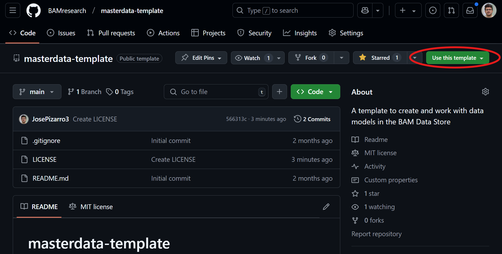

# masterdata-diffpy-refinement
A repository to create and work with DiffPy-based structural refinements for PDF analysis.

## Generating your DiffPy Refinement repository

1. Click on **Use this template** button on the top right and create a new DiffPy refinement repository.



2. The next screen will prompt you to choose a GitHub organization or profile for the new repository, as well as a name. We recommend naming the repository starting with `masterdata-`, e.g., `masterdata-diffpy-refinement`, so it is easily recognized.

3. After creating your new repository, you can:
    1. Open it in GitHub Codespaces
    2. Clone it locally

4. You need to create a new Python 3.7 environment due to strict compatibility requirements:

```sh
conda create -n diffpy python=3.7
conda activate diffpy
pip install numpy>=1.18 scipy>=1.4 pandas>=1.0 matplotlib>=3.1 seaborn>=0.11 tqdm>=4.0 psutil>=5.7
pip install diffpy-cmi==3.0.0
# Optional, if PDFgetX3 license is available
pip install diffpy.pdfgetx==2.1.1
```

5. The repository structure will be:

```sh
masterdata-diffpy-refinement/
├── LICENSE (MIT)
├── README.md
├── sample_refinement.py
├── CIFs/
│   └── example_structure.cif
├── data/
│   └── example_diffraction.dat
├── fits/
└── utils/
```

6. Run the refinement script with:

```sh
conda activate diffpy
python sample_refinement.py
```

7. The refinement configuration variables to edit (`sample_refinement.py`):

```python
mypowderdata = 'data/example_diffraction.dat'
composition = 'O7 V2 Zr1'
ciffile = {'example_structure.cif': ['P213', False, (1, 1, 1)]}
anisotropic = False
unified_Uiso = True
```

## Development

You can customize the refinement script (`sample_refinement.py`) and add additional scripts or utility functions under `utils/`.

## GitHub actions

GitHub actions defined in `.github/workflows/` will:

1. Ensure formatting and type consistency in Python code according to PEP-8 standards (with `mypy` and `ruff`).
2. Verify consistency of structural refinements through automated tests.

If the pipeline passes, it means your code adheres to good practices and is structurally consistent.

## Publishing as an independent PyPI package

The action `.github/workflows/publish.yml` already implements publishing to PyPI. When you are ready:

1. Define a GitHub secret named `PYPI_API_TOKEN` obtained from [pypi.org](https://pypi.org/).
2. Create a **Release** from the GitHub repository page.

More information: [GitHub PyPI documentation](https://packaging.python.org/en/latest/guides/publishing-package-distribution-releases-using-github-actions-ci-cd-workflows/).
