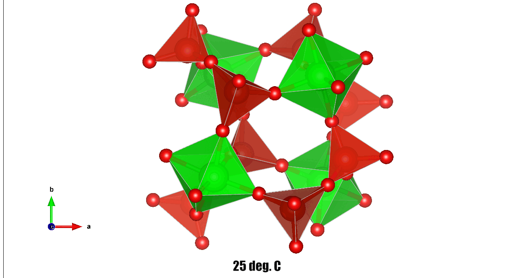

# Structural Refinement of ZrV₂O₇ with Negative Thermal Expansion Using Pair Distribution Function Analysis

Author: Tomasz Stawski (tomasz.stawski@bam.de)
Testing and Implementation: Aiste Miliute (aiste.miliute@bam.de)
Version: 1.0.0
License: MIT License

[](https://doi.org/10.5281/zenodo.15395753)




## Overview

This repository contains object-oriented Python scripts specifically developed for structural refinement of Zirconium Vanadate (ZrV₂O₇), a material known for its negative thermal expansion (NTE). The scripts implement Pair Distribution Function (PDF) analysis to refine crystal structures directly from experimental X-ray diffraction (XRD) data. The refinement workflow is built around the DiffPy-CMI library, enhanced with custom functionalities tailored for ZrV₂O₇ and similar oxide materials.

The primary capabilities and key technical details of the scripts include:

- **Configuration-Driven Refinement Plan:** 
  The workflow is directed by a user-defined plan specifying a sequence of refinement steps, each with its own set of parameters.

- **Sequential Dataset Analysis:** 
  The framework can process a list of datasets in order, using the output of one refinement as the starting model for the next. It performs stepwise optimization of lattice parameters, atomic coordinates, atomic displacement parameters (ADPs), oxygen occupancy, and nanoscale domain sizes (using characteristic functions). Optimization is carried out using robust gradient-based minimization algorithms (e.g., L-BFGS-B), carefully managing parameter constraints and refinement order to achieve stable convergence.


- **State Checkpointing**: 
  The refinement state is saved after each major step, allowing the workflow to be resumed after an interruption.

- **Rigid-body Constraints and Connectivity-based Refinement:**  
  Incorporates physically-informed rigid-body restraints based on well-defined polyhedral connectivity. This includes explicit constraints on bond lengths and angles within ZrO₆ octahedra and VO₄ tetrahedra, ensuring structural parameters remain physically realistic and chemically sensible.

- **Adaptive Space-group Symmetry Switching:**  
  Provides functionality to easily transition between different space-group settings (e.g., from higher symmetry groups such as Pa-3 to lower symmetry groups like P213, P23, and ultimately P1). This capability allows the systematic exploration of potential symmetry-breaking structural distortions or subtle symmetry variations typical of NTE materials.

- **Parallelized PDF Calculations:**  
  Implements parallel processing using Python’s multiprocessing capabilities, optimizing performance during the calculation of PDF patterns from structural models. This significantly accelerates refinement for large datasets or complex structural models.

- **Comprehensive Visualization and Statistical Analysis:**  
  Automatically generates a variety of plots and summary statistics, including:
  - Observed vs. calculated PDF curves.
  - Difference plots (residuals).
  - Histograms of bond length distributions for Zr–O and V–O bonds.
  - Detailed bond-angle distributions for critical polyhedral linkages (O–Zr–O, O–V–O, Zr–O–V, V–O–V).
  - Export of refined crystal structures as CIF files for further analysis or reporting.

- **Detailed Logging and Reporting:**  
  Automatically logs each refinement step, including parameter adjustments, convergence criteria, refinement ranges, and space-group transitions. This functionality ensures reproducibility and facilitates detailed analysis of refinement pathways.

- **Structured Output Generation:** 
  The script generates an organized set of outputs for each step, including refined CIF files, fit plots, data files, and summary reports.


---

## Requirements and Installation

This section outlines software installation using Anaconda, with required and optional software.

### Software Requirements

- Python 3.7 (strictly required for compatibility with DiffPy-CMI)
- DiffPy-CMI `3.0.0`, [DiffPy-CMI](https://www.diffpy.org/products/diffpycmi/index.html).
- NumPy
- SciPy
- Pandas
- Matplotlib
- Seaborn
- tqdm
- psutil
- dill


> **Important:**  
> Python 3.7 is strictly required for compatibility with DiffPy-CMI. Creating a dedicated Python 3.7 environment is strongly recommended.

---

### Creating a Dedicated Anaconda Python 3.7 Environment

Create and activate a new Anaconda environment:

```bash
conda create -n diffpy python=3.7
conda activate diffpy
```

---

### Installing DiffPy-CMI (Anaconda only)

Add the DiffPy Anaconda channel and install DiffPy-CMI:

```bash
conda config --add channels diffpy
conda install diffpy-cmi
```

---

### Optional but Highly Recommended: PDFgetX3

PDFgetX3 is strongly recommended for direct PDF generation from raw XRD data but requires a separate license.

**Note:**  
If PDFgetX3 is not installed, scripts must be manually adjusted to directly load pre-generated PDF/g(r) data from CSV files. 
For more information about PDFgetX3, visit [DiffPy PDFgetX3](https://www.diffpy.org/products/pdfgetx.html).

---
## Usage
The framework is architected with a clear separation of concerns into two primary scripts.

_sample_refinement_vXX_classes.py:_ This file is the core engine of the framework. It contains all the Python classes that handle configuration, PDF generation, structural analysis, results management, and the high-level workflow orchestration. You should not need to modify this file.

_sample_refinement_vXX_execution.py:_ This is the user-facing script. You configure and run your analysis from here. It is responsible for defining all parameters, setting up the refinement plan, and initiating the workflow.

---

### Project and Data Inputs

All aspects of the refinement are controlled by the `project_config` dictionary within the `sample_refinement_vXX_execution.py` script. Below is a detailed breakdown of the key parameters you will need to set.

Example input definitions from the script:

```python

project_config = {
    # 1. Project and File Paths
    'project_name': 'ZirconiumVanadate_Refinement/', # A name for the overall project
    'xrd_directory': 'data/',        # Folder containing your experimental PDF data files
    'cif_directory': 'CIFs/',        # Folder for your initial structural model (.cif) files
    'fit_directory': 'fits/',        # Root directory where all outputs will be saved

    # 2. Datasets to Process
    # A list of experimental data files to be processed in sequence.
    'dataset_list': [
        'PDF_ZrV2O7_061_25C_avg_46_65_00000.dat',
        'PDF_ZrV2O7_061_60C_avg_66_85_00000.dat'
    ],

    # 3. Structural Model
    # Defines the initial crystal structure model(s).
    # Format: {'cif_filename': [space_group, is_periodic, supercell_expansion]}
    'ciffile': {'98-005-9396_ZrV2O7.cif': ['Pa-3', True, (1, 1, 1)]},
    'composition': 'O7 V2 Zr1', # Stoichiometry, used for PDF calculation

    # Provides detailed information for each element, used for geometric analysis
    # and setting initial Atomic Displacement Parameters (ADPs).
    'detailed_composition': {
        'Zr': {'symbol': 'Zr', 'Uiso': 0.0065, 'polyhedron_center': True, 'cutoff': (1.8, 2.2)},
        'V':  {'symbol': 'V',  'Uiso': 0.0100, 'polyhedron_center': True, 'cutoff': (1.5, 2.4)},
        'O':  {'symbol': 'O',  'Uiso': 0.0250, 'polyhedron_vertex': True},
    },

    # 4. Instrumental and PDF Calculation Parameters
    'qmax': 22.0,                   # Maximum scattering vector (Å⁻¹) for the Fourier transform
    'qdamp': 2.70577268e-02,        # Instrumental resolution damping factor (from calibration)
    'qbroad': 2.40376789e-06,       # Instrumental resolution broadening factor (from calibration)
    'myrange': (0.0, 80.0),         # The full r-range (Å) for PDF calculation
    'myrstep': 0.05,                # Step size (Å) for the r-grid

    # 5. Refinement Control
    # Controls how Atomic Displacement Parameters (ADPs) are handled.
    'anisotropic': False,           # Set to True to refine anisotropic ADPs
    'unified_Uiso': True,           # If True, all atoms of the same element share one Uiso value

    # Advanced settings for the optimization algorithm.
    'convergence_options': {'disp': True},
    
    # 6. Checkpoint & Logging
    'checkpoint_directory': 'fits/ZirconiumVanadate_Refinement/checkpoints/',
    'log_file': 'refinement_log.txt',
}
```
In the same file, define your multi-step refinement strategy in the `refinement_plan` dictionary. Each step is an entry in the dictionary, specifying the symmetry, constraints, and fitting procedure for that stage.

```python
refinement_plan = {
    # Step 0: Initial refinement in high-symmetry space group
    0: {
        'description': 'Initial fit with Pa-3 symmetry',
        'space_group': ['Pa-3'],
        'constraints': {'constrain_bonds': (True, 0.001), 'constrain_angles': (True, 0.001)},
        'fitting_range': [1.5, 27],
        'fitting_order': ['lat', 'scale', 'psize', 'delta2', 'adp', 'xyz', 'all']
    },
    # Step 1: Reduce symmetry and refine again
    1: {
        'description': 'Symmetry reduction to P1 with tight constraints',
        'space_group': ['P1'],
        'constraints': {'constrain_bonds': (True, 0.0001), 'constrain_angles': (True, 0.0001)},
        'fitting_range': [1.5, 27],
        'fitting_order': ['lat', 'scale', 'psize', 'delta2', 'adp', 'xyz', 'all']
    }
}
```
For the very first dataset in a sequence, you can provide a "special structure" (e.g., a CIF file from a previous experiment) to be used as a better starting point than the original CIF. This is configured in project_config:
```python
project_config = {
    # ... other settings
    'special_structure': {
        'file_path': 'fits/path/to/your/previous_result.cif',
        'phase_index_to_update': 0 
    },
}
```

The framework can also run in a simulation-only mode to generate a theoretical PDF from a known set of parameters. This is useful for validating a final structure or understanding the effect of specific parameters. Configure the simulation_data dictionary in the execution script and uncomment the final call to workflow_orchestrator.simulate_pdf_workflow().

```python
simulation_data = {
    'cif_directory': 'optimised_PDF_fits_vs_Temp/25C_Phase0_6/',
    'ciffile': {'opt_25C_Phase0_6.cif': ['P1', True, (1, 1, 1)]},
    'powder_data_file': 'PDF_ZrV2O7_061_25C_avg_46_65_00000.dat',
    'output_path': 'resultsSimulations/25C_Phase0_6',
    'optimized_params': {
        'Phase0': {'s': 4.92399836e-01, 'psize': 2.66658626e+02, 'delta2': 2.53696631e+00}
    },
    'default_Uiso': {
        'Zr': 5.79086780e-04,
        'V': 3.21503909e-03,
        'O': 7.21519003e-03
    },
    'fitting_range': [1.5, 27],
    'csv_filename': 'sim_vs_obs.csv'
}
```

---
## Usage and Fitting Procedure

This section describes the detailed workflow for structural refinement of Zirconium Vanadate (ZrV₂O₇) from PDF data. The script is capable of refining single-phase structures and can be adapted for multi-phase systems with additional adjustments.

---

### Overview

The refinement procedure involves several systematic stages:

1. **Generating the experimental PDF** from X-ray diffraction data.
2. **Creating PDF contributions** linked to structural models defined by CIF files.
3. **Setting up a refinement recipe** with constraints based on the initial symmetry and rigid-body requirements.
4. **Sequential refinement** in several stages, progressively lowering the space-group symmetry.
5. **Applying rigid-body constraints** on bond lengths and angles to ensure physically meaningful structures.
6. **Collecting and visualizing results**, including partial PDFs, refined CIF files, bond-length distributions, and angle statistics.

---

### Detailed Refinement Steps

Each refinement stage follows this structured approach:

- **Space-group symmetry adjustment:**  
  Change structural symmetry from high (Pa-3) to lower symmetry settings (P213, P23, P1).

- **Rigid-body constraints:**  
  Apply and adjust constraints on bond lengths and angles.

- **Sequential parameter refinement:**  
  Parameters refined in each step include lattice parameters (`lat`), scale factors (`scale`), particle size (`psize`), peak shape (`delta2`), atomic displacement parameters (`adp`), and atomic positions (`xyz`).

**Specific refinement steps:**

| Step | Space Group | Bond Constraints (σ) | Angle Constraints (σ) | PDF range (Å) | Purpose |
|------|-------------|----------------------|-----------------------|---------------|---------|
| 0    | Pa-3        | 0.001                | 0.001                 | 1.5–27        | Initial high-symmetry refinement |
| 1    | Pa-3        | 0.0001               | 0.0001                | 1.5–27        | Refine with tighter constraints |
| 2    | P213        | 0.001                | 0.001                 | 1.5–27        | Test response to reduced symmetry |
| 3    | P23         | 0.001                | 0.001                 | 1.5–27        | Further symmetry exploration |
| 4    | P23         | 0.0001               | 0.0001                | 1.5–27        | Precise refinement at lower symmetry |
| 5    | P1          | 0.001                | 0.001                 | 1.5–27        | Lowest symmetry flexibility |
| 6    | P1          | 0.0001               | 0.0001                | 1.5–27        | Final refinement under strictest constraints |

After completing these steps, the script extrapolates the final refined model across the full PDF range (0–80 Å) for comprehensive evaluation.

---

## Multi-Phase Refinements (Optional)

The provided refinement script supports simultaneous fitting of multiple structural phases. The basic functionality—such as PDF generation, scaling, and individual phase contributions—is fully operational. However, the use of rigid-body constraints (bond lengths, angles, dihedrals) in multi-phase scenarios has not been thoroughly tested and may introduce unexpected behaviors. Additional verification is recommended if rigid-body constraints are applied across multiple phases.

### How to Define Multi-Phase CIF Input

Multi-phase refinements are configured by modifying the `ciffile` dictionary in your script. The dictionary format is as follows:

```python
ciffile = {
    'Phase1_filename.cif': ['SpaceGroup1', periodic1, (nx1, ny1, nz1)],
    'Phase2_filename.cif': ['SpaceGroup2', periodic2, (nx2, ny2, nz2)],
    # Add additional phases as needed
}

```
---

## Rigid-Body Constraints Implementation

Rigid-body constraints ensure physically meaningful refinements by controlling bond lengths, bond angles, and optionally dihedral angles. These constraints are particularly important for complex structures like ZrV₂O₇ to avoid unphysical configurations.

### Step-by-Step Procedure

The script implements rigid-body constraints through the following sequential steps:

### 1. **Calculation of Bond Vectors**  
- The script first identifies relevant polyhedral units (ZrO₆ and VO₄) and computes bond vectors within these units, applying predefined distance cutoffs.

### 2. **Identification of Bond Pairs**  
- Using the calculated bond vectors, bond pairs (Zr–O, V–O, and O–O) are determined for each polyhedron, considering symmetry and periodic boundary conditions.

### 3. **Angle and Dihedral Identification**  
- Bond angles (e.g., O–Zr–O, O–V–O, Zr–O–V, V–O–V) are identified based on connectivity. Optionally, dihedral angles involving four-atom combinations are also determined, if specified in the script.

### 4. **Constraint Expression Generation**  
- Mathematical expressions describing bond lengths and angles in terms of atomic coordinates are generated dynamically. These expressions form the basis of the constraints applied during refinement.

### 5. **Classification and Application of Constraints**  
- Bond constraints are categorized and applied with varying strictness:
  - **Normal Bonds:** Constraints typically applied with standard deviation (`σ`) around 0.001 to 0.0001.
  - **Shared Bonds (e.g., V–O–V):** More strictly constrained due to their structural significance, typically with very tight σ (e.g., 1e-8).
  - **Edge Bonds:** Bonds near unit cell boundaries are constrained tightly (σ ~1e-7).
  - **Problematic Bonds:** Bonds outside acceptable lengths (<1.6 Å or >1.9 Å for V–O bonds) receive stricter constraints.

- Angle and dihedral constraints follow a similar categorization, typically constrained with a narrow tolerance (~±1–2°).

### 6. **Dynamic Updating (Adaptive Constraints)**  
- Optionally, constraints can be recalculated dynamically (adaptive constraints) after each refinement step to account for structural changes, although this feature is disabled (`adaptive=False`) by default.

### 7. **Final Cleanup of Constraints**  
- Constraints that become irrelevant (e.g., due to symmetry changes or refinement progress) are automatically removed from subsequent refinement steps.

---

### How to Set Rigid-Body Constraints in the Script

The strength and type of constraints are controlled via these parameters:

```python
constrain_bonds = (True, 0.001)      # Enable bond constraints with σ = 0.001
constrain_angles = (True, 0.001)     # Enable angle constraints with σ = 0.001
constrain_dihedrals = (False, 0.001) # Dihedral constraints disabled by default
```


## Performance Note

The unit cell of the ZrV₂O₇ structure considered in this refinement is large, containing **1080 atoms**. Consequently, the number of fitted parameters increases significantly as the refinement progresses and symmetry constraints are progressively relaxed to lower space groups (from Pa-3 to P1).

As a practical reference, refining the full series of symmetry reductions and rigid-body constraints on an **AMD Ryzen 7840U** processor, with approximately **80% CPU utilization**, typically takes about **16 hours** to complete all refinement steps (with settings as in the script). Users should consider these performance implications when planning refinements.


## License

MIT License (see LICENSE)


## Support and Contact

Tomasz Stawski  
tomasz.stawski@bam.de  
tomasz.stawski@gmail.com


