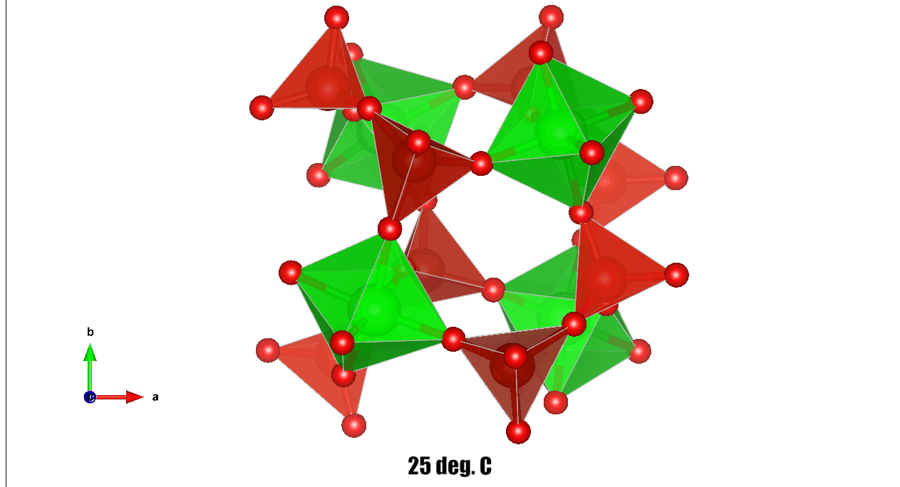

# Structural Refinement of ZrV₂O₇ with Negative Thermal Expansion Using Pair Distribution Function Analysis

Authors:
- Tomasz Stawski (tomasz.stawski@bam.de, tomasz.stawski@gmail.com)
- Aiste Miliute (aiste.miliute@bam.de)

Version: 1.3.0
License: MIT License

[](https://doi.org/10.5281/zenodo.17579927)



## Overview

This repository contains object-oriented Python scripts developed for structural refinement of zirconium vanadate (ZrV₂O₇), a material known for its isotropic negative thermal expansion (NTE). The scripts implement Pair Distribution Function (PDF) analysis to refine crystal structures directly from experimental X-ray diffraction (XRD) data. The refinement workflow is built around the DiffPy-CMI library, extended with custom functionalities tailored for ZrV₂O₇. With some adjustments the workflow can be easily used for refinement of other materials. 

**Note:** This repository also includes a complete experimental dataset as well as a completed fit series for reference and publication purposes.

The primary capabilities and key technical details of the scripts include:

- **Configuration-Driven Refinement Plan:** The workflow is directed by a user-defined plan specifying a sequence of refinement steps, each with its own set of parameters. The workflow also supports structural refinement of mixed or multiphase materials.
- **Sequential Dataset Analysis:** The framework can process a list of datasets in order, using the output of one refinement as the starting model for the next. It performs stepwise optimisation of lattice parameters, atomic coordinates, atomic displacement parameters (ADPs) etc. Optimisation is carried out using gradient-based minimisation algorithms (e.g., L-BFGS-B, among others).
- **State Checkpointing:** The refinement state is saved after each major step, allowing the workflow to be resumed after an interruption.
- **Rigid-body Constraints and Connectivity-based Refinement:** Incorporates physically-informed rigid-body restraints based on polyhedral connectivity. This includes explicit constraints on bond lengths and angles within polyhedra.
- **Adaptive Space-group Symmetry Switching:** Provides functionality to easily transition between different space-group settings (e.g., from higher symmetry groups such as Pa-3 to lower symmetry groups such as P1).
- **Parallelised PDF Calculations:** Implements parallel processing.
- **Comprehensive Analysis, Logging, and Reporting:** Automatically logs each refinement step and generates an organised set of structured outputs. This includes refined CIF files, fit plots, data files, summary reports, and a variety of statistical analyses (e.g., observed vs. calculated PDF curves, difference plots, histograms of bond length distributions, detailed bond-angle distributions, and transversal displacements).
---

## Requirements and Installation

This section outlines software installation using Anaconda or Miniconda, with required and optional software.

### Software Requirements

- Python (3.7+ is supported, but newer versions are recommende with updated DiffPy-CMI releases)
- [DiffPy-CMI](https://github.com/diffpy/diffpy.cmi/) (Version 3.1.2 or newer is recommended)
- NumPy
- SciPy
- Pandas
- Matplotlib
- Seaborn
- scikit-learn
- tqdm
- psutil
- dill
- pymatgen (https://pymatgen.org/)

> **Note:**  
> Creating a dedicated Python environment for this project is strongly recommended to prevent dependency conflicts.

### Installation via Conda (suggested Method)

The suggested method is to use Miniconda or Anaconda and install from the `conda-forge` channel.

First, add the `conda-forge` channel:

```bash
conda config --add channels conda-forge
```

Then, create and activate a new environment (e.g., `diffpy`) and install `diffpy.cmi`:

```bash
conda create -n diffpy diffpy.cmi
conda activate diffpy
```

Finally, install the remaining required dependencies within the active environment:

```bash
conda install numpy scipy pandas matplotlib seaborn scikit-learn tqdm psutil dill
```

### Optional but Highly Recommended: PDFgetX3

PDFgetX3 is strongly recommended for direct PDF generation from raw XRD data but requires a separate license (https://www.diffpy.org/products/pdfgetx.html).

**Note:**  
If PDFgetX3 (`diffpy.pdfgetx`) is not installed, the framework features an automated fallback routine. It will automatically bypass real-time PDF calculation and load pre-generated PDF/g(r) data from corresponding `.gr` files located in the fallback directory (default `dataXRDandGofRs/`). You do not need to manually modify the scripts.

---

## Code Structure

The framework is divided into modular scripts handling specific parts of the workflow.

- **`pdf_refinement_core.py`**: This file is the core of the framework. It acts as the backend and should not need manual modification. It contains all the specific Python classes that drive the logic.
- **`pdf_execution.py`**: Main Automated Structural Refinement.
- **`pdf_calibration.py`**: Instrumental Calibration.
- **`pdf_simulation.py`**: Structural Simulation and Post-Fit Forensics Analysis.
- **`pdf_clustering.py`**: Unsupervised Learning and Clustering Analysis.
- **`pdf_analysis_and_visualisation.py`**: Aggregated Results Analysis & Visualisation.

---

## 1. Automated Structural Refinement via PDF Analysis (`pdf_execution.py`)

This section outlines the purpose, structure, and configuration options available in the `pdf_execution.py` script.

`pdf_execution.py` is the primary execution environment for automated, multi-stage structural refinements against PDF X-ray scattering data. It coordinates the backend object-oriented framework defined in `pdf_refinement_core.py`. A single execution run can span any number of experimental datasets, for instance, a full temperature series, processing each one in turn through a `refinement_plan`.

#### Multi-Dataset Processing

The script is designed to process any number of experimental datasets supplied in `dataset_list`. Datasets are fitted sequentially: each one passes through the complete `refinement_plan` before the script moves to the next. This makes the workflow well-suited to parametric series (temperature, time, pressure, etc.) where systematic evolution of structural parameters is expected.

#### Connected vs. Independent Dataset Fitting

The behaviour between consecutive dataset fits is controlled by the `start_each_dataset_fresh` flag in `project_config`:

- **`False` (default — connected mode):** Each dataset is initialised from the optimal structural model returned by the previous dataset. This is the recommended setting for smooth parametric series, significantly reducing the number of optimisation steps needed.
- **`True` (independent mode):** Each dataset is initialised fresh from the base `ciffile` and `special_structure` fallback model, treating every dataset as a fully independent fit. This is appropriate when datasets are not related (e.g., different samples) or when the structural evolution between steps is too large for a warm start to be stable.

#### State Checkpointing and Resumption

Refinement state is automatically saved after each major step in the `refinement_plan`. If execution is interrupted, the workflow can be resumed from the last completed checkpoint without reprocessing the entire dataset queue. The log file (`refinement_log.txt`) is the primary reference for auditing the refinement history.

### Core Configuration (`project_config`)

The `project_config` dictionary is the central definition block for all experimental parameters, input/output paths, and methodological settings. All entries are described below.

```python
project_config = {

    # -------------------------------------------------------------------------
    # Directory Mapping
    # Defines all input and output paths. Paths are relative to the script location.
    # -------------------------------------------------------------------------
    'project_name': 'YourProjectName/', # Root label applied to all output subdirectories
    'xrd_directory': 'dataXRD/',        # Location of raw .dat scattering data files
    'data_dir_gr':  'dataXRDandGofRs/', # Location of pre-calculated .gr files (PDFgetX3 fallback)
    'cif_directory': 'CIFs/',           # Location of structural .cif starting models
    'fit_directory': 'fits/',           # Root output directory for all refinement results
    'log_file': 'refinement_log.txt',   # Path to the running parameter log

    # -------------------------------------------------------------------------
    # Dataset Selection
    # List all .dat or .gr filenames to be processed in order.
    # Commented-out entries are skipped without being removed from the list.
    # -------------------------------------------------------------------------
    'dataset_list': [
        'PDF_ZrV2O7_061_25C_avg_46_65_00000.dat',
        'PDF_ZrV2O7_061_60C_avg_66_85_00000.dat',
        # Add or comment out datasets here...
    ],

    # -------------------------------------------------------------------------
    # Dataset Initialisation Mode
    # Controls whether consecutive datasets share structural state.
    #   False: Each dataset starts from the converged model of the previous one (connected mode).
    #   True:  Each dataset starts fresh from the base CIF and special_structure fallback (independent mode).
    # -------------------------------------------------------------------------
    'start_each_dataset_fresh': False,

    # -------------------------------------------------------------------------
    # Special Structure Fallback
    # An optional pre-optimised CIF used to seed the structural model at the
    # beginning of a refinement run.
    #
    # Relationship to 'ciffile':
    #   'ciffile' remais the reference model. It supplies the fundamental
    #   crystallographic definition: space-group symmetry, asymmetric-unit
    #   topology, and lattice metric. It is always required.
    #
    #   'special_structure' is a pre-optimised P1 *variant* of that same model with
    #   atomic coordinates already refined against a
    #   representative dataset. Its atomic positions therefore override those
    #   read from 'ciffile' for the designated phase, providing a better
    #   starting point than the as-deposited CIF.
    #
    # When it is applied:
    #   - Connected mode (start_each_dataset_fresh = False):
    #       Replaces the starting coordinates for the very first dataset only.
    #       Subsequent datasets inherit the converged model of the preceding fit.
    #   - Independent mode (start_each_dataset_fresh = True):
    #       Applied before every dataset, resetting coordinates to this
    #       pre-optimised state rather than the bare 'ciffile' each time.
    # -------------------------------------------------------------------------
    'special_structure': {
        'file_path': 'CIFs/preoptimised_model.cif',
        'phase_index_to_update': 0  # Which phase index in ciffile to replace
    },

    # -------------------------------------------------------------------------
    # Structural and Chemical Definitions
    # 'ciffile' defines the structural starting model(s). Each key-value pair
    # registers one crystallographic phase. The dictionary key is the CIF
    # filename (located in 'cif_directory'); the value is a list of three
    # elements:
    #   1. String: Initial space-group setting (e.g., 'Pa-3').
    #   2. Boolean: True = periodic bulk crystal; False = isolated finite nanoparticle.
    #   3. Tuple: Supercell expansion multipliers along (a, b, c).
    #
    # Single-phase example (default):
    #   'ciffile': {'Phase_A.cif': ['Pa-3', True, (1, 1, 1)]}
    #
    # Multiphase example — each entry defines an independent structural phase
    # that receives its own PDF contribution and scale factor in the fit:
    #   'ciffile': {
    #       'Phase_A.cif': ['Pa-3',  True, (1, 1, 1)],
    #       'Phase_B.cif': ['Fm-3m', True, (1, 1, 1)],
    #   }
    #   Phases are indexed in insertion order (Phase_A → index 0,
    #   Phase_B → index 1, …), which is the index referenced by
    #   'phase_index_to_update' in 'special_structure'.
    #
    # Caution (multiphase): simultaneous fitting of multiple phases is
    # supported, but the use of rigid-body constraints in multiphase
    # configurations has not been extensively validated and may introduce
    # unexpected interactions between phases. Use with care.
    # -------------------------------------------------------------------------
    'ciffile': {'98-005-9396_ZrV2O7.cif': ['Pa-3', True, (1, 1, 1)]},

    # Overall empirical stoichiometry — guides atomic density and normalisation routines.
    'composition': 'O7 V2 Zr1',

    # Per-species settings used for rigid-body constraints and forensics:
    #   'symbol':            Elemental identifier (must match CIF atom labels).
    #   'Uiso':              Initial isotropic thermal displacement (Ų).
    #   'polyhedron_center': If True, atom acts as the centre of a rigid polyhedron.
    #   'polyhedron_vertex': If True, atom acts as a vertex (ligand) of a rigid polyhedron.
    #   'cutoff':            (min, max) bond-length range (Å) used by the forensics module.
    'detailed_composition': {
        'Zr': {'symbol': 'Zr', 'Uiso': 0.0065, 'polyhedron_center': True,  'polyhedron_vertex': False, 'cutoff': (1.8, 2.2)},
        'V':  {'symbol': 'V',  'Uiso': 0.0100, 'polyhedron_center': True,  'polyhedron_vertex': False, 'cutoff': (1.5, 2.4)},
        'O':  {'symbol': 'O',  'Uiso': 0.0250, 'polyhedron_center': False, 'polyhedron_vertex': True},
    },

    # -------------------------------------------------------------------------
    # Instrument and Resolution Parameters
    #   'qdamp':  Resolution dampening factor — controls the exponential fall-off
    #             of the G(r) envelope at high r due to finite Q-resolution.
    #   'qbroad': Peak broadening parameter from instrumental delta-Q distributions.
    #   'qmax':   Upper limit of momentum transfer Q (Å⁻¹) used in the Fourier transform.
    #   'refine_qdamp' / 'refine_qbroad': Set True to freely co-refine the instrumental
    #             parameters alongside structural variables (not recommended for routine runs;
    #             use pdf_calibration.py instead).
    # -------------------------------------------------------------------------
    'qdamp':  2.70577268e-02,
    'qbroad': 2.40376789e-06,
    'qmax':   22.0,
    'refine_qdamp':  False,
    'refine_qbroad': False,

    # -------------------------------------------------------------------------
    # ADP Handling Strategy
    # Defines how atomic displacement parameters (ADPs) — describing the mean-
    # square amplitude of thermal vibrations — are modelled during refinement.
    #
    # Initial ADP values:
    #   In 'isotropic' mode, starting values are taken from 'detailed_composition'
    #   ('Uiso' field, in Ų) and applied element-wide: all atoms of the same
    #   species share a single constrained Uiso, which is the only ADP parameter
    #   refined for that element.
    #   In 'anisotropic' and 'fixed_shape' modes, the full anisotropic tensor
    #   (Uij) is read directly from the CIF file when present. The 'Uiso' value
    #   in 'detailed_composition' serves only as a fallback for atoms whose CIF
    #   entry does not contain anisotropic displacement data.
    #
    # Available modes:
    #   'isotropic':   Spherical model — one Uiso per element, shared by all
    #                  atoms of that species. Fastest; appropriate for routine
    #                  refinements or when data resolution is insufficient to
    #                  resolve per-atom or anisotropic motion.
    #   'anisotropic': Full tensor — all six independent Uij components per atom
    #                  are freely refined. Requires anisotropic displacement data
    #                  in the CIF and significantly increases the parameter count.
    #   'fixed_shape': Scaled anisotropic — the Uij tensor shape (principal axes
    #                  and orientation) is preserved from the CIF, but its overall
    #                  magnitude is scaled by a single free parameter per atom.
    #                  Intermediate cost; useful when the tensor geometry is
    #                  physically trusted but the magnitude requires adjustment.
    # -------------------------------------------------------------------------
    'adp_mode': 'isotropic',

    # -------------------------------------------------------------------------
    # Calculation Range
    #   'myrange':  (r_min, r_max) in Å — the G(r) calculation and fitting envelope.
    #   'myrstep':  Grid spacing (Å) for the PDF calculation.
    #   'sgoffset': Space-group origin offset, if required by the crystal setting.
    # -------------------------------------------------------------------------
    'myrange':  (0.05, 80),
    'myrstep':  0.05,
    'sgoffset': [0.0, 0.0, 0.0],

    # -------------------------------------------------------------------------
    # PDFgetX3 Processing Defaults
    # Applied when converting raw .dat scattering data to G(r) via diffpy.pdfgetx.
    # These settings are bypassed when loading pre-calculated .gr files.
    # Supported options (refer to PDFgetX3 documentation for full details):
    #   'mode':       Scattering type ('xray' or 'neutron').
    #   'dataformat': Input Q-space format ('twotheta', 'QA' [Å⁻¹], or 'Qnm' [nm⁻¹]).
    #   'wavelength': X-ray wavelength (Å) — required only for 'twotheta' format.
    #   'composition': Chemical composition (e.g., 'Zr V2 O7').
    #   'backgroundfile': Path to the background/empty holder datafile.
    #   'bgscale':    Scaling factor for the background intensities (default 1).
    #   'rpoly':      r-limit (Å) for the maximum frequency in the F(Q) correction 
    #                 polynomial (default 0.9). Higher values give closer fits.
    #   'qmaxinst':   Q-cutoff (Å⁻¹) for meaningful input intensities.
    #   'qmin':       Lower Q-limit (Å⁻¹) for the Fourier transformation.
    #   'qmax':       Upper Q-limit (Å⁻¹) for the Fourier transformation.
    #   'rmin':       Lower bound of the r-grid (Å) for the calculated PDF.
    #   'rmax':       Upper bound of the r-grid (Å) for the calculated PDF.
    #   'rstep':      Spacing of the r-grid (Å) for the calculated PDF.
    # -------------------------------------------------------------------------
    'pdfgetx_config': {
        'mode':       'xray',
        'dataformat': 'QA',
        'rpoly':      1.3,
        'qmin':       0.0
    },

    # -------------------------------------------------------------------------
    # Global Optimiser Settings
    #   'optimizer':        Algorithmic framework to use for parameter refinement.
    #       - 'minimize':      General-purpose scalar minimisation (Scipy).
    #       - 'least_squares': Non-linear least-squares (Scipy). Often more robust
    #                          for fitting problems by directly targeting residuals.
    #       - 'basinhopping':  Global optimisation strategy that wraps 'minimize'.
    #                          Escapes local minima by performing random "hops".
    #
    #   'optimizer_method': Specific algorithm for the chosen framework.
    #       - For 'minimize': 'L-BFGS-B' is strongly recommended. It is a
    #                         quasi-Newton method that handles high-dimensional
    #                         parameter spaces efficiently and supports bounds.
    #       - For 'least_squares': 'trf' (Trust Region Reflective) is standard.
    #
    #   Recommendations:
    #       - Use 'minimize' with 'L-BFGS-B' for standard sequential refinements.
    #       - Use 'basinhopping' if the fit is consistently getting trapped in
    #         unphysical local minima (e.g., during the very first dataset fit).
    #
    #   'basinhopping_options': Configuration for the global strategy (if selected).
    #       'stepsize': Magnitude of coordinate perturbation per trial.
    #       'niter':    Number of basin-hopping iterations (higher = better search).
    #       'T':        "Temperature" parameter controlling acceptance probability.
    # -------------------------------------------------------------------------
    'optimizer':        'minimize',
    'optimizer_method': 'L-BFGS-B',
    'basinhopping_options': {'stepsize': 50, 'niter': 100, 'T': 200.0},
    'convergence_options': {'disp': True},  # Verbose output from the optimiser
}
```

### The Refinement Plan

The refinement logic is segmented into numbered steps in `refinement_plan`. These guide the system sequentially from highly constrained, high-symmetry initial estimates down to relaxed, lower-symmetry global optimisations. Each step defines its own space group, constraint settings, fitting range, and the order in which parameter groups are activated.

```python
refinement_plan = {
    0: {
        'description': 'Initial baseline fit with Pa-3 symmetry and standard constraints',
        'space_group': ['Pa-3'],
        'force_cubic_lattice': True,   # Force strict cubic scaling even as symmetry drops
        'constraints': {'constrain_bonds': (True, 0.001), 'constrain_angles': (True, 0.001),
                        'constrain_dihedrals': (False, 0.001), 'adaptive': True},
        'fitting_range': [1.5, 27],
        'fitting_order': ['lat', 'scale', 'psize', 'delta2', 'adp', 'xyz', 'all']
    },
    1: {
        'description': 'Partial symmetry reduction to P23 to probe intermediate distortions',
        'space_group': ['P23'],
        'force_cubic_lattice': True,
        'constraints': {'constrain_bonds': (True, 0.001), 'constrain_angles': (True, 0.001),
                        'constrain_dihedrals': (False, 0.001), 'adaptive': True},
        'fitting_range': [1.5, 27],
        'fitting_order': ['lat', 'scale', 'psize', 'delta2', 'adp', 'xyz', 'all']
    },
    2: {
        'description': 'Full symmetry relaxation to P1 for unconstrained independent atomic refinement',
        'space_group': ['P1'],
        'force_cubic_lattice': True,
        'constraints': {'constrain_bonds': (True, 0.001), 'constrain_angles': (True, 0.001),
                        'constrain_dihedrals': (False, 0.001), 'adaptive': True},
        'fitting_range': [1.5, 27],
        'fitting_order': ['lat', 'scale', 'psize', 'delta2', 'adp', 'xyz', 'all']
    }
}
```

Key `refinement_plan` parameters:
- **`space_group`**: The crystallographic symmetry applied during this step.
- **`force_cubic_lattice`**: If `True`, forces strict cubic equivalence of the *a*, *b*, *c* axes even as symmetry is lowered.
- **`constraints`**: A tuple `(active, tolerance)` per constraint type. If `adaptive: True`, constraints are automatically eased proportionally to the achieved fit residual as the step progresses.
- **`fitting_range`**: `[r_min, r_max]` in Å — the radial range over which the fit is evaluated.
- **`fitting_order`**: The chronological sequence in which parameter groups are activated within the step (see below).

### Fitting Order Pipeline
The `'fitting_order'` parameter determines the chronological activation of variables within a single sequence step:
- `lat`: Lattice parameter calibration.
- `scale` / `psize` / `delta2`: Instrument, nanoparticle sizes, and correlated vibrations.
- `adp`: ADPs.
- `xyz`: Fractional coordinate optimisation.
- `all`: Independent multi-variable free refinement of eveyrything.

### Dynamic Parallel Processing

The framework automatically adjusts resource utilisation to local hardware.

```python
syst_cores = multiprocessing.cpu_count()
cpu_percent = psutil.cpu_percent()
avail_cores = np.floor((100 - cpu_percent) / (100.0 / syst_cores))
ncpu = int(np.max([1, avail_cores]))
pool = Pool(processes=ncpu)

# Injection of the pool into the heavy lifting manager
pdf_manager = PDFManager(config, ncpu, pool)
```

### Workflow and Fitting Procedure

The overall refinement procedure involves several systematic stages:

1. **Generating the experimental PDF** from XRD data (via PDFgetX3 or pre-calculated `.gr` files).
2. **Creating PDF contributions** linked to structural models defined by CIF files.
3. **Setting up a refinement recipe** with constraints based on the initial symmetry and rigid-body requirements.
4. **Sequential refinement** in several stages, progressively lowering the space-group symmetry.
5. **Applying rigid-body constraints** on bond lengths and angles to ensure physically meaningful structures.
6. **Collecting and visualising results**, including partial PDFs, refined CIF files, bond-length distributions, and angle statistics.

Each refinement stage follows this structured approach:

- **Space-group symmetry adjustment:** Change structural symmetry from high (Pa-3) to lower symmetry settings (P213, P23, P1).
- **Rigid-body constraints:** Apply and adjust constraints on bond lengths and angles.
- **Sequential parameter refinement:** Parameters refined in each step include lattice parameters (`lat`), scale factors (`scale`), particle size (`psize`), peak shape (`delta2`), ADPs (`adp`), and atomic positions (`xyz`).

The following table summarises the example refinement steps used in this study:

| Step | Space Group | Bond Constraints (σ) | Angle Constraints (σ) | PDF range (Å) | Purpose |
|------|-------------|----------------------|-----------------------|---------------|---------|
| 0    | Pa-3        | 0.001                | 0.001                 | 1.5–27        | Initial high-symmetry refinement |
| 1    | Pa-3        | 0.0001               | 0.0001                | 1.5–27        | Tighter constraints at same symmetry |
| 2    | P213        | 0.001                | 0.001                 | 1.5–27        | Probe response to reduced symmetry |
| 3    | P23         | 0.001                | 0.001                 | 1.5–27        | Further symmetry exploration |
| 4    | P23         | 0.0001               | 0.0001                | 1.5–27        | Precise refinement at lower symmetry |
| 5    | P1          | 0.001                | 0.001                 | 1.5–27        | Lowest symmetry flexibility |
| 6    | P1          | 0.0001               | 0.0001                | 1.5–27        | Final refinement under strictest constraints |

After completing these steps, the final refined model is evaluated across the full PDF range (0–80 Å) for comprehensive assessment.

---

## 2. Instrumental Calibration (`pdf_calibration.py`)

### Overview
This module (`pdf_calibration.py`) performs instrumental calibration for PDF refinements. It extracts the instrumental damping (`qdamp`) and broadening (`qbroad`) parameters by refining a structural standard (such as $\text{LaB}_6$ or $\text{CeO}_2$) against experimental X-ray scattering data.

### Calibration Methodology
The script uses the `PDFWorkflowManager` to execute isolated refinement stages designed to extract instrumental effects. It initialises the backend structure through `PDFRefinement(..., pdf_manager, results_manager, ...)` and evaluates models iteratively.

Instrumental parameters such as damping (`qdamp`) and broadening (`qbroad`) govern signal attenuation at high momentum transfer and long distances. Consequently, it is a physical requirement that they be refined over an extended macroscopic range using the L-BFGS-B minimiser configured in `project_config`.

1. **Sequential Full-Range Refinement**:
   - The structural fitting envelope is set from 1.5 Å to 100.0 Å to encompass instrumental signal attenuation across extended distances.
   - The refinement isolates `qdamp` and `qbroad` iteratively in distinct passes. This approach limits mathematical coupling and aids in producing stable instrumental constants.

### System Configuration and Parameters
Calibration is directed by the `project_config` dictionary located inside the script:
- Configures input targets (`xrd_directory`, `data_dir_gr`, and references a `ciffile`).
- Utilises execution flags to enable `refine_qdamp = True` and `refine_qbroad = True`.
- **`use_shape_envelope`**: Set to `False` to disable finite-size attenuation mapping. This directs the framework to treat the standard as an infinite bulk crystal to isolate instrumental `qdamp`.
- **`qdamp`**: Accounts for the attenuation of the scattering signal resolution at high momentum transfer.
- **`qbroad`**: Accounts for instrumental Gaussian peak broadening.

### Outputs
Refinement data and trace files are generated automatically in the designated `fit_directory`:
- **`calibration_log.txt`**: Records parameter convergence across refinement stages.
- Graphical representations (`.png`/`.svg`) displaying the fit residuals for the standard material.
- Atomic coordinate arrays exported as periodic `.cif` checkpoints.

### Usage
Ensure the referenced local `data` and `CIFs` subdirectories hold the experimental diffraction files and standard reference models, respectively.

```bash
python pdf_calibration.py
```

---

## 3. Structural Simulation and Post-Fit Forensics Analysis (`pdf_simulation.py`)

### Overview
This module (`pdf_simulation.py`) provides tools for simulating and validating structural models generated from PDF refinements. It separates the structural evaluation and forensics processes from the primary fitting workflow found in `pdf_execution.py`.

The script evaluates atomic configurations (such as refined `.cif` checkpoints) using two modules: Theoretical $G(r)$ Simulation and Structural Forensics.

### Analytical Methodologies

The script uses the `PDFWorkflowManager` to conduct the following evaluations:

### 1. Theoretical PDF Simulation
Takes a `.cif` model and generates its theoretical real-space scattering distribution ($G(r)$) by passing configurations to `workflow_orchestrator.simulate_pdf_workflow()`.
- Applies physical parameters derived from refinement, including the scale factor (`s`), particle size (`psize`), and correlated atomic vibration (`delta2`). 
- Compares the theoretical simulation against the experimental dataset using `PDFManager.generatePDF()`. The experimental data is processed via `diffpy.pdfgetx` or loaded directly from precalculated `.gr` files if the package is unavailable.
- Outputs residual comparisons and numerical arrays covering the simulated vector and the experimental vector (`sim_vs_obs.csv`) managed by `ResultsManager`.

### 2. Structural Forensics Analysis
Performs a geometric analysis of the spatial coordinates based on the model lattice using `workflow_orchestrator.run_structural_forensics()`. 
- Calculates bond lengths, angles, and dihedral configurations via `StructureAnalyzer` (e.g. `get_polyhedral_bond_vectors()` and `find_bond_pairs()`).
- Compares the extracted geometry against predefined physical tolerance limits (e.g., $V-O$ cut-offs specified in the `detailed_composition` configuration).
- Flags unphysical deformations or outliers to facilitate structural assessment, automatically saving outputs via `workflow_orchestrator.visualize_structural_forensics()`.

### System Configuration and Parameters

The analysis uses two primary configuration dictionaries defined at the beginning of the file:
1. `project_config`: Contains the overarching settings (composition, instrument parameters like `qdamp` and `qbroad`, `r_range`, and the `data_dir_gr` fallback directory). Furthermore, it accepts the `use_shape_envelope` boolean dictating whether finite-crystallite attenuation is mathematically evaluated (`True`) or structurally bypassed mapping bulk crystal behavior (`False`).
2. `simulation_data`: Specifies the inputs for the simulation run, including the `powder_data_file`, `ciffile`, output directory, and refined parameters (`optimized_params`).

### Outputs
The script generates datasets saved to the directory specified by `output_path`:
- **Quantitative Diagnostics**: Detailed reports tracking outlier counts and polyhedral boundary distributions, saved as text files.
- **Statistical Visualisations**: Histograms showing the distribution of targeted bond lengths are rendered as `.png` files. 

### Requirements
Execution requires Python 3 with the following dependencies:
- `diffpy.srreal`, `diffpy.srfit`, `diffpy.Structure`
- `numpy`, `pandas`, `matplotlib`
- Pre-calculated `.gr` experimental source files (if `diffpy.pdfgetx` is not installed).

### Usage
Configure the `simulation_data` dictionary with the appropriate `.dat` or `.gr` observation files and a valid `.cif` file, then run:

```bash
python pdf_simulation.py
```

---

## 4. Unsupervised Learning and Clustering Analysis of PDF Sequential Data (`pdf_clustering.py`)

### Overview
This module (`pdf_clustering.py`) provides an automated, unsupervised statistical analysis pipeline for evaluating sequential solid-state structural datasets. Specifically, it applies multiple clustering, factorisation, and dimensionality reduction techniques to a series of PDF curves. 

The primary objective is to mathematically identify and quantify macroscopic structural phase transitions, map continuous unit-cell evolution, and pinpoint correlation breaks across parametric sequences (such as temperature-dependent experiments).

### Features and Analytical Methodologies

The script executes five distinct analytical methods to ensure robust structural interpretation:

1. **Spectral Clustering:**
   - Evaluates the series using `spectral_cluster_curves()` by calculating a pairwise Euclidean dissimilarity graph scaled by a Gaussian kernel via Scikit-Learn. 
   - *Purpose:* Partitions the dataset into distinct, discrete structural regimes or phases, highlighting non-linear transitions.

2. **Non-negative Matrix Factorisation (NMF):**
   - Assumes the total diffracted signal is a continuous linear combination of purely positive "basis" structural components.
   - *Purpose:* Maps gradual compositional structural conversions, enabling the tracking of intermediate or mixed states as mathematical weights rather than strict phase boundaries.

3. **Correlation Matrix Analysis:**
   - Computes a complete Pearson Correlation dissimilarity topograph across native dimensionality using Pandas dataframes.
   - *Purpose:* Visually identifies highly stable foundational regimes (bright blocks) versus sudden structural disruption or degradation (dark boundaries).

4. **Principal Component Analysis (PCA) & 3D Phase Space:**
   - Extracts the dominant orthogonal basis vectors representing maximal sequence variance (e.g., thermal expansion or major distortion mechanisms) using `sklearn.decomposition.PCA`.
   - *Purpose:* Resolves the evolution as a connected path through a 3D phase space topology, where smooth trajectories imply continuous parametric shifts and fragmentations imply total phase transformation.

5. **Hierarchical Clustering:**
   - Computes a linkage matrix strictly incorporating Ward's minimal variance method using `scipy.cluster.hierarchy`.
   - *Purpose:* Generates a quantitative structural lineage tree (dendrogram) mapping precisely where structural families diverge or converge.

### Data Inputs

The script expects raw diffraction data in the `QA` format to dynamically generate corresponding PDF curves $G(r)$. 

- **Primary Source (`dataXRD/`):** The script searches for standard sequential `.dat` scattering files. Native curve generation relies on the `diffpy.pdfgetx` library.
- **Fallback Source (`dataXRDandGofRs/`):** If `diffpy` is absent from the execution environment, the script executes a robust fallback routine. It will parse pre-calculated `.gr` files and perfectly interpolate the structural data onto the required spatial grid, maintaining mathematical standardisation for downstream clustering.

### Automated Outputs

All outputs, encompassing both raw data and derived analytical graphics, are automatically exported to a dedicated `ClusteringAnalysis/` directory created at runtime.

- **Graphical visualisations:** All figures generated by the analyses are immediately saved as both high-resolution `.png` vectors and scalable `.svg` variants.
- **Raw Data Matrices:** 
    - `01_Spectral_Clusters.csv` (Discrete categorisations)
    - `02_NMF_Weights.csv` (Continuous phase weights)
    - `03_Correlation_Matrix.csv` (Pearson network topology)
    - `04_PCA_Trajectories.csv` (PC parametric series)
    - `05_Hierarchical_Linkage.csv` (Ward's distances)

### Requirements
The execution requires Python 3 with the following primary dependencies:
- `numpy`, `pandas`, `matplotlib`, `seaborn`
- `scipy`, `scikit-learn`
- *(Optional but Recommended)* `diffpy.pdfgetx` for real-time calculations.

### Usage
Ensure the parameter block at the top of the script (`data_dir`, `composition`, `qmin`, `qmax`, and `r_range`) is configured to match the targeted experimental limits before execution. 

```bash
python pdf_clustering.py
```

---

## 5. Aggregated Results Analysis & Visualisation Suite (`pdf_analysis_and_visualisation.py`)

### Overview
The `analysis_and_visualisation.py` module is a dedicated post-processing tool within the structural refinement pipeline. Its primary objective is to aggregate, analyse, and visualise the structural outcomes derived from sequence-based experimental data (such as temperature-dependent PDF datasets).

This suite bypasses manual data inspection by actively scanning the output directories generated during sequential fitting. It extracts critical refinement quality metrics, underlying lattice parameters, specifically targeted variables (such as ADPs and particle size estimations), and intricate topological bonding distributions.

### Core Features
1. **Automated Data Aggregation**: Scans through dataset subdirectories to collect refinement summaries and compile cumulative iteration sequences into `.csv` metric traces.
2. **Quality Assessment Profiling**: Generates visual convergence logs tracking the global evolution of the structural fit residual (`Rw`) to evaluate algorithmic stability across the entire dataset series.
3. **Structural Forensics Evaluation**: Categorises local V-O coordination topologies (isolated, terminal, bridge, linker) and flags unphysical anomalous bond lengths (> 1.80 Å). Additionally extracts bond geometries and calculates transversal displacements across key atomic triplets. Transversal displacement measures the perpendicular offset of a central bridging atom — such as oxygen — away from the linear axis connecting its two adjacent metal atoms.
4. **Adaptive Trend Visualisation**: Produces multi-panel trend analyses where data axes dynamically auto-scale to prioritise physical trends over calculated algorithmic uncertainties.

### Generated Outputs
Upon execution, the script generates a designated output folder (defaulting to `Analysis_Report_Summary/`), which will contain the following files:

- **`summary_table.csv`**: A comprehensive tabular compilation containing every extracted structural and fitting parameter alongside the dataset temperature.
- **`1_Rw_vs_Temp.png`**: Visualises the final achievable fit quality as a function of temperature.
- **`2_Lattice_vs_Temp.png`**: Tracks the expansion (or contraction) of the primary cubic lattice parameter (`a`) throughout the series.
- **`3_Forensics_Outliers.png`**: Displays a bar chart denoting the proportion of structurally anomalous bonds identified within the refinement.
- **`3b_Utra_vs_Temp.png`**: Plots the mean transversal displacement (U_tra) for specific atomic triads as a function of temperature.
- **`4_Convergence_Traces.png`**: A global, logarithmically scaled trace map detailing the exact step-by-step mathematical descent towards convergence for each temperature.
- **`5_Bond_Evolution_Violin.png`**: A detailed violin distribution plot illustrating the statistical density of varying bond topologies.
- **`6_Parameters_Evolution.png`**: A 2x3 multi-panel auto-scaled grid graphing the targeted refinement variables (e.g., specific `Uiso` and `delta2`).
- **`7_Utra_Distribution_<triad>.png`**: Overlaid Kernel Density Estimate (KDE) distributions coloured by temperature, mapping the dynamic evolution of transversal displacements.
- **`8_Angle_Distribution_<triad>.png`**: Overlaid KDE distributions coloured by temperature, tracking the evolution of specific bond angles across the experimental series.

### Requirements and Configuration
The script fundamentally relies on the global experimental settings designated within `project_config`, which is directly imported from `pdf_execution.py`.
It specifically targets the `fit_directory` path defined within that configuration array as its base search directory.

Ensure the target directories retain standard naming conventions featuring extractable integers (e.g., `..._105C_...`) so the parser can seamlessly map variables against experimental series parameters.

---

## Multi-Phase Refinements (Optional)

The refinement script supports simultaneous fitting of multiple structural phases. However, the use of rigid-body constraints in multi-phase scenarios has not been thoroughly tested and may introduce unexpected behaviours.

Multi-phase refinements are configured by modifying the `ciffile` dictionary:
```python
ciffile = {
    'Phase1_filename.cif': ['SpaceGroup1', periodic1, (nx1, ny1, nz1)],
    'Phase2_filename.cif': ['SpaceGroup2', periodic2, (nx2, ny2, nz2)],
}
```

---

## Rigid-Body Constraints Implementation

Rigid-body constraints ensure physically meaningful refinements by controlling bond lengths, bond angles, and optionally dihedral angles. These constraints are particularly important for complex structures like ZrV₂O₇ to avoid unphysical configurations.

### Step-by-Step Procedure

1. **Calculation of Bond Vectors:**  
   The script first identifies relevant polyhedral units (ZrO₆ octahedra and VO₄ tetrahedra) and computes bond vectors within these units, applying predefined distance cutoffs from `detailed_composition`.

2. **Identification of Bond Pairs:**  
   Using the computed bond vectors, bond pairs (Zr–O, V–O, and O–O) are determined for each polyhedron, considering symmetry and periodic boundary conditions.

3. **Angle and Dihedral Identification:**  
   Bond angles (e.g., O–Zr–O, O–V–O, Zr–O–V, V–O–V) are identified based on atomic connectivity. Optionally, dihedral angles involving four-atom combinations are also determined if enabled in the `refinement_plan`.

4. **Constraint Expression Generation:**  
   Mathematical expressions describing bond lengths and angles in terms of fractional atomic coordinates are generated dynamically. These expressions form the basis of the penalty terms applied during optimisation.

5. **Classification and Application of Constraints:**  
   Bond constraints are categorised and applied with varying strictness:
   - **Normal bonds:** Standard deviation (σ) around 0.001–0.0001.
   - **Shared bonds (e.g., V–O–V bridging oxygens):** More strictly constrained due to structural significance (σ ~1×10⁻⁸).
   - **Edge bonds:** Bonds near unit cell boundaries are constrained tightly (σ ~1×10⁻⁷).
   - **Problematic bonds:** Bonds outside acceptable lengths (e.g., V–O bonds < 1.6 Å or > 1.9 Å) receive stricter constraints automatically.
   - Angle and dihedral constraints follow a similar categorisation, typically constrained within ±1–2°.

6. **Dynamic Updating (Adaptive Constraints):**  
   When `adaptive: True` is set in the `refinement_plan`, constraints are recalculated after each step, with their tolerance automatically eased proportionally to the current fit residual. This allows the model to progressively relax as the fit improves.

7. **Final Cleanup:**  
   Constraints that become irrelevant (e.g., due to symmetry changes or refinement progress) are automatically removed from subsequent steps.

### Constraint Parameters

The strength and type of constraints are controlled via these parameters in the `refinement_plan`:

```python
'constraints': {
    'constrain_bonds':     (True, 0.001),   # Enable bond constraints with σ = 0.001
    'constrain_angles':    (True, 0.001),   # Enable angle constraints with σ = 0.001
    'constrain_dihedrals': (False, 0.001),  # Dihedral constraints disabled by default
    'adaptive': True                         # Automatically ease constraints as fit improves
}
```

---

## Performance Note

The unit cell of the ZrV₂O₇ structure contains 1080 atoms. The number of fitted parameters increases significantly as symmetry constraints are progressively relaxed to lower space groups (from Pa-3 to P1).

As a practical reference, refining the full series of symmetry reductions and rigid-body constraints on an AMD Ryzen 7840U processor, with approximately 80% CPU utilisation, typically takes about 16 hours to complete all refinement steps. 

---

## License

MIT License (see LICENSE)

---

## Support and Contact

Tomasz Stawski  
tomasz.stawski@bam.de  
tomasz.stawski@gmail.com


